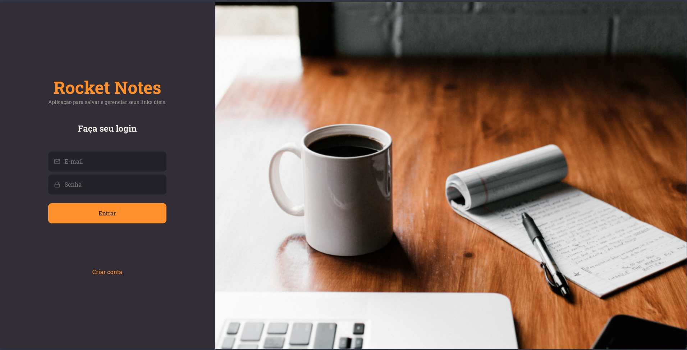
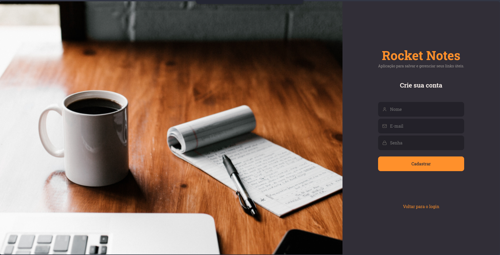
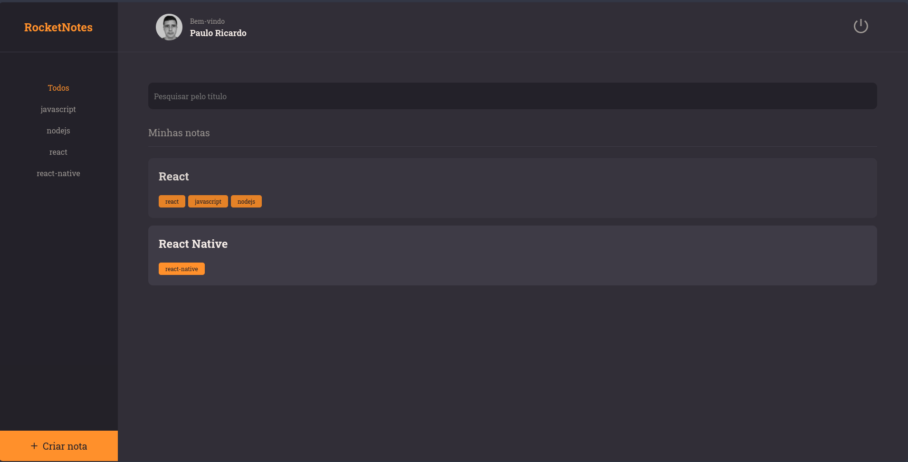
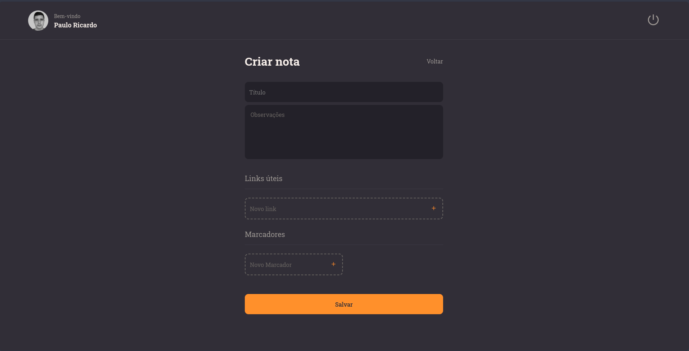
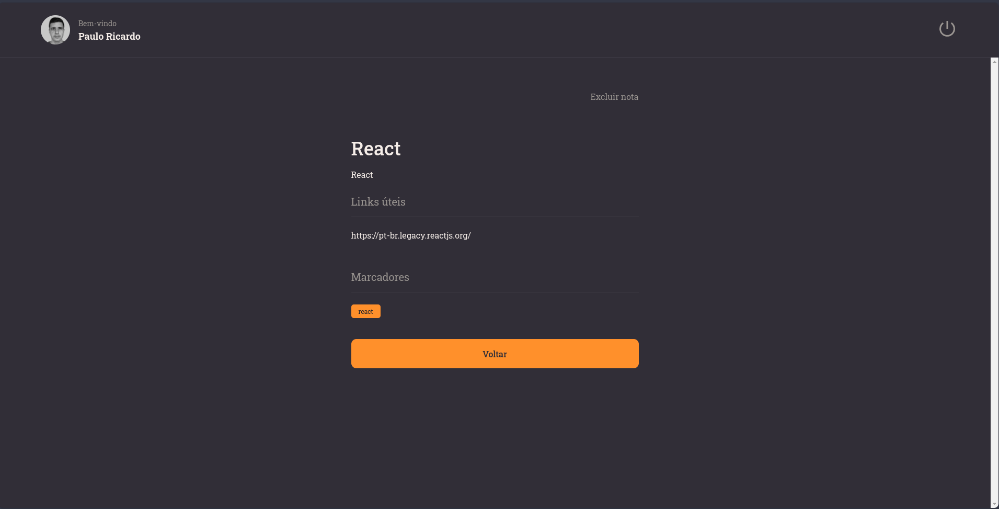
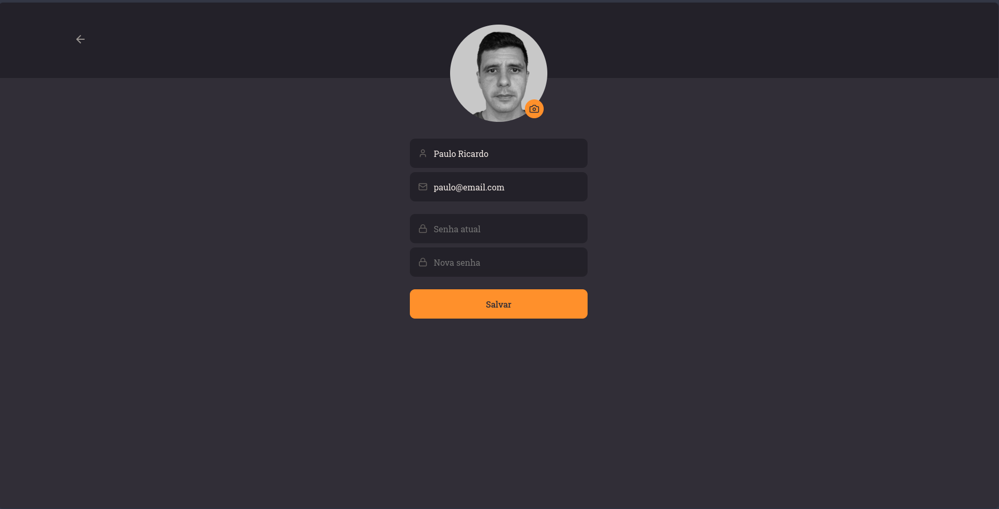

<h1 align="center">📃 RocketNotes </h1>


## 📁 Projeto

- Frontend desenvolvido em React do projeto RocketNotes, aplicação para salvar e gerenciar links úteis!

## 📃 Páginas

- A aplicação conta com páginas de login, cadastro, visualizar nota, perfil e criar nota.

<div align="center">
  
  
  
  
  
  
</div>

## ⭐ Site

A aplicação RocketMovies está disponível para utilização [aqui](https://pcaldirocketnotes.netlify.app/).

## 🛠️ Funcionalidades

- Login;
- Cadastro;
- Mostrar perfil;
- Atualizar perfil;
- Cadastrar notas;
- Mostrar notas cadastradas;
- Filtrar notas;
- Mostrar detalhes da nota;
- Excluir nota;
- Logout;

## 🚀 Tecnologias

Este projeto foi desenvolvido com as seguintes tecnologias:

- ViteJS;
- ReactJS;
- Styled Components;
- React Icons;
- React Router;
- Axios;

## 🎡 Rodando o projeto localmente

```
$ git clone https://github.com/pcaldi/rocketnotes
$ cd rocketnotes
$ npm install
$ npm run dev
```
## 👨🏻‍💻 Autor

<a href="https://github.com/pcaldi">
 
 <br />
 <sub><b>Paulo Caldi</b></sub></a> <a href="https://github.com/pcaldi" title="emoji">🙋🏻</a>
 <br />

[](https://www.linkedin.com/in/pcaldi/)
[](mailto:pcaldi@gmail.com)


---
